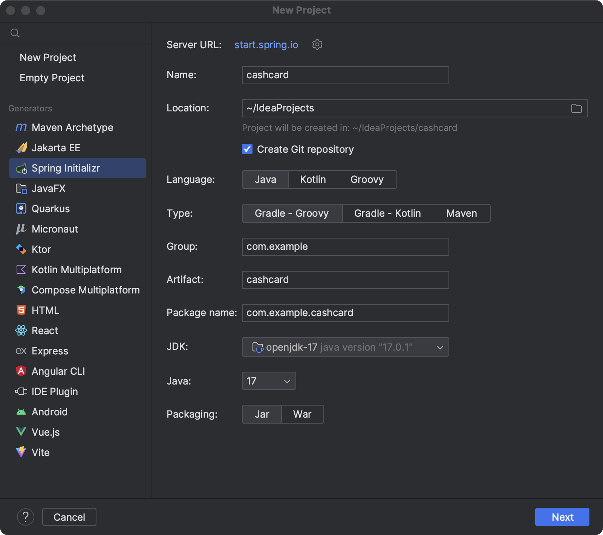
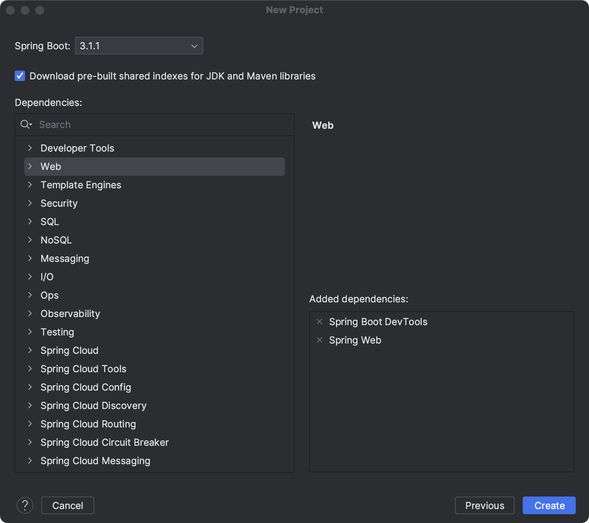

# Building a REST API with Spring Boot

## What will you build?

> You'll be building a simple Family Cash Card application — a modern way for parents to manage allowance funds for their kiddos. Parents often find themselves lacking an easy way to manage (i.e. send, receive, track) allowances for their kids. So instead of handing out a stack of bills, our cloud-based Family Cash Card app allows parents to virtually manage "cash cards" for their kiddos. You can think of the cash card being very similar to a gift card that many of us send and receive. The primary goal of the Family Cash Card app is to give parents ease and control over managing funds for their children. You'll use Spring Boot to progress from creating a single cash card in a database to allowing for the editing, deleting, and viewing of multiple cash cards, and finally securing your app against unauthorized access and unwanted exploits.

## Lab01: Spring Initializr

> Spring and Spring Boot are Java frameworks for building applications. Spring is versatile with many modules, while Spring Boot is a streamlined version with pre-configured settings and dependencies. Spring Boot uses Spring Core's Inversion of Control container and Spring Initializr is a tool for generating ready-to-run Spring Boot applications.

